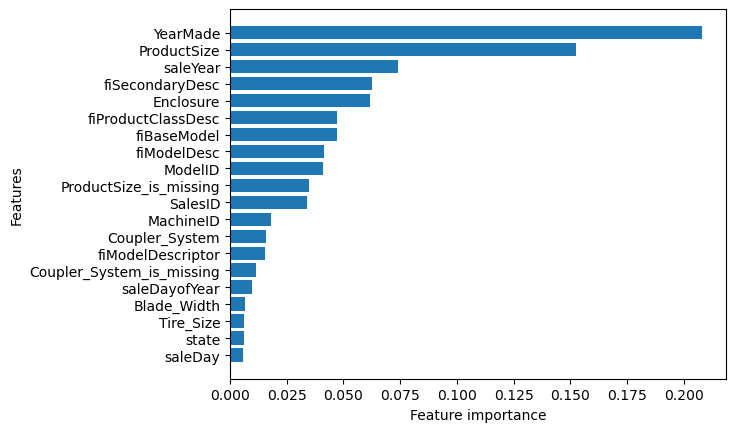

# Bulldozer Prediction Price
A machine Learning project aimed at predicting the future sale price of a buldozer given its characteristics and previous exapmples of how much similar bulldozers have been sold for.

## Table of contents
+ Project Overview
+ Installation


### Project Overview
The project was done with the aim of testing out various machine learning models and and tools for a regression problem on predicting a bulldozer sale price. The evaluation metric used was Root Mean Squared Logarithmic Error (RMSLE).
The steps taking in creating the model:

- **Exploratory Data Analysis**: Which involves going through the data, it's columns and it's rows, checking for missing data, correlation, relationships and patterns in the data.

- **Filling Missing Data**: This is a crucial part of the model creation purpose, Models cannot thoroughly learn from Nan values. The method of filling is crucial. Mode is one of the best methods to fill in missing data for categorical and object data types if no other relationships exist and for numerical datatypes, median is the best method for filling.

- **Converting categorical data into Numerical form and encoding them**: As the intro says,this section involves converting all categorical and all object dtypes into Numerical dtypes. This is crucial as Machine learning Models only learn from Numerical data.

- **Modelling**: This section involving applying machine learning models to our already clean datase. In this project Ensemble's Random Forest Regressor was evaluated and tuned on the dataset to see how well it could learn. On the evaluation metric it got an RMSLE score of `0.2452`.

**Feature Importance**

Feature importances shows how much each column contributed to the final prediction. The feature `YearMade` had the best feature importance score.



### Installation
1. **Clone The Repository**
	```bash
	https://github.com/Darc-lord/Bulldozer-Price-Prediction.git
	cd Bulldozer-Price-Prediction
	```
2. **Download Dataset**
	```bash
	 https://www.kaggle.com/c/bluebook-for-bulldozers/data
	```	

## Acknoledgements
+ Kaggle
+ Scikit-learn
